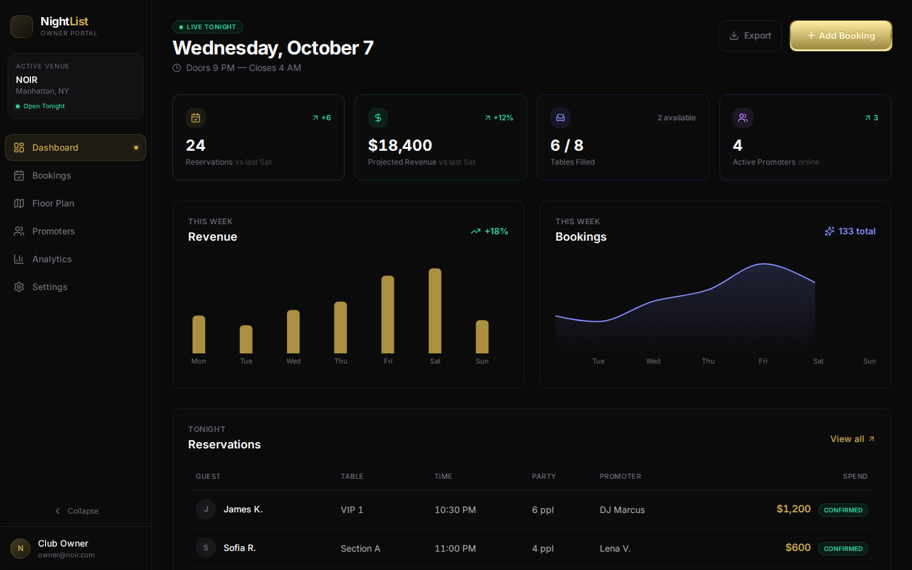
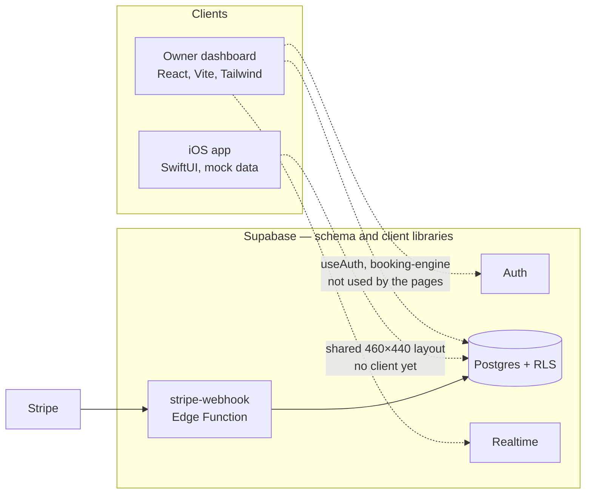

# Night List

Nightlife table booking for venue owners and guests: a React dashboard, a SwiftUI floor-plan viewer, and a Supabase schema for accounts, reservations, and deposits.

There is no hosted deployment in this repository. Dashboard numbers, promoter names, and iOS venues are sample data.

## Dashboard

These shots are the local dev server (`npm run dev`) with the sample data that ships in the pages.




## Features

Checked against the code in this repo.

| Area | What works today |
| --- | --- |
| Floor plan builder | `dashboard/src/pages/FloorPlanPage.tsx` lets you add, drag, and edit tables (VIP, premium, booth, bar) and fixtures (stage, dance floor, bar). Positions snap to a 12px grid on a 460×440 canvas. Layouts autosave to `localStorage`. |
| Bookings | `BookingsPage` searches and filters a hardcoded reservation list and opens a guest-list modal. It does not read or write the database. |
| Promoters | `PromotersPage` shows a sample roster with tiers, commission, and referral links. Invite and copy are not wired up. |
| Analytics | `AnalyticsPage` renders Recharts for revenue, bookings, peak hours, table mix, and promoter ROI from static series. The 7d / 30d / 90d control does not change the data. |
| Settings | `SettingsPage` edits venue profile, hours, house rules, notification toggles, and commission rates, then saves them to `localStorage`. The Stripe Connect card always says "Connected". |
| Booking engine | `dashboard/src/lib/booking-engine.ts` calls the `lock_table` and `create_booking` Postgres functions (10-minute table locks, one active booking per table per date, promoter commission rows). It also attaches a Stripe PaymentIntent id and enforces status transitions. No screen imports this module yet. |
| Auth | `useAuth` signs in, signs up, and signs out with Supabase Auth and loads `profiles.role` (`guest`, `promoter`, `owner`, `admin`). Signup inserts a profile via a database trigger. The dashboard has no login screen. |
| iOS viewer | The SwiftUI app (`ios/NightList`) has Discover, venue detail, a blueprint floor plan, a booking sheet, and an owner tab. All of it uses in-memory mock venues. The blueprint scales the same 460×440 coordinate system as the web canvas, and the NOIR mock tables match the dashboard defaults. There is no network client and no live sync. |

`prototype/NightListPrototype.jsx` is an earlier single-file UI sketch. It is not part of the dashboard build.

## Architecture



The solid arrow is the webhook handler, which reads `STRIPE_SECRET_KEY`, `STRIPE_WEBHOOK_SECRET`, and `SUPABASE_SERVICE_ROLE_KEY` from the function environment. The dashed arrows are code that exists but is not connected to the screens you see.

Postgres tables: `profiles`, `venues`, `venue_tables`, `events`, `promoters`, `table_locks`, `bookings`, `commissions`. Row level security is enabled. Realtime is published for `bookings`, `table_locks`, and `venue_tables`.

## Tech stack

| Piece | In this repo |
| --- | --- |
| Owner dashboard | React 18, TypeScript, Vite 5, Tailwind CSS 3, Recharts |
| iOS app | SwiftUI, Swift 5, iOS 17 (`NightList.xcodeproj`) |
| API and database | Supabase: Auth, Postgres 17, Realtime, one Edge Function |
| Payments | Stripe webhook handler in `supabase/functions/stripe-webhook` (Deno). No Stripe SDK in the iOS target or the dashboard bundle. |

## Repo layout

```
night-list/
├── dashboard/                 # Owner dashboard
├── ios/NightList/             # SwiftUI app
├── prototype/                 # Early single-file React sketch
├── supabase/
│   ├── config.toml
│   ├── migrations/001_initial_schema.sql
│   └── functions/stripe-webhook/
├── .env.example
└── .github/workflows/ci.yml
```

## Local setup

Install the [Supabase CLI](https://supabase.com/docs/guides/cli), Docker, and Node.js 22.

```bash
supabase start
supabase status
```

`supabase status` prints the local API URL and anon key. Copy the example env file into the dashboard (Vite reads env from `dashboard/`, not the repo root):

```bash
cp .env.example dashboard/.env
```

Set:

- `VITE_SUPABASE_URL` — local API URL, usually `http://127.0.0.1:54321`
- `VITE_SUPABASE_ANON_KEY` — the anon key from `supabase status`
- `VITE_STRIPE_PUBLISHABLE_KEY` — a Stripe publishable key if you add checkout later

The dashboard screens render sample data without those variables. `dashboard/src/lib/supabase.ts` throws on import if either Supabase variable is missing, which matters once a screen imports the client.

```bash
cd dashboard
npm ci
npm run dev
```

Vite serves the dashboard at `http://localhost:5173`.

```bash
npm run lint
npm run typecheck
npm run build
npm run preview
```

### iOS

Open `ios/NightList.xcodeproj` in Xcode and run the NightList scheme on an iOS 17 simulator. GitHub Actions does not build the Swift target. There is no macOS runner or Xcode step in CI.

## Status

This is a portfolio project, not a production booking service.

- Owner screens are a clickable UI with sample data. Floor plans and settings stay in the browser.
- The database migration, RLS policies, booking functions, auth hook, booking client, availability hook, and Stripe webhook are written and not hooked up to those screens.
- The iOS app does not call Supabase. Layout coordinates match the web canvas by convention only.
- CI runs dashboard lint, `tsc --noEmit`, a production build, and a gitleaks scan. It does not start Supabase or compile iOS.

## Roadmap

- Sign-in screen that uses `useAuth`, and owner-only navigation.
- Load and save bookings, promoters, analytics, settings, and floor plans through Supabase instead of sample arrays and `localStorage`.
- Point the iOS blueprint and booking flow at the same `venue_tables` and `bookings` rows, including Realtime availability.
- Stripe Checkout in the client, then deploy `stripe-webhook` with its secrets set outside the repo.
- App Store build, once the iOS app talks to a real backend.

## License

[MIT](LICENSE)

Built by [@lloredia](https://github.com/lloredia).
