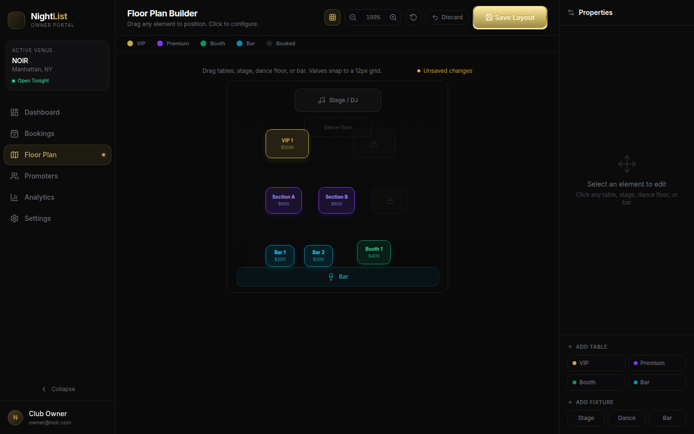
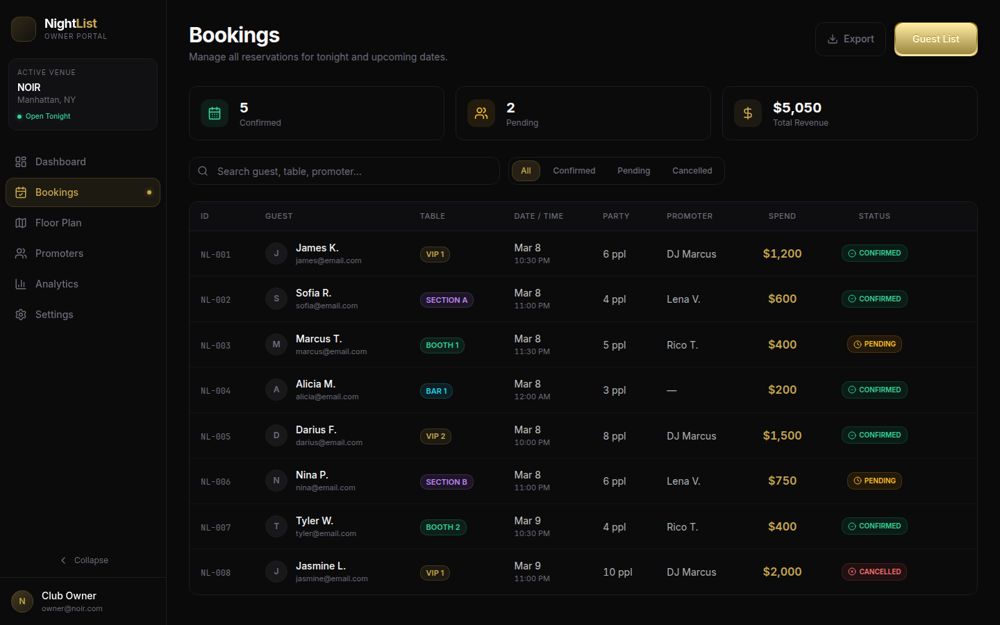
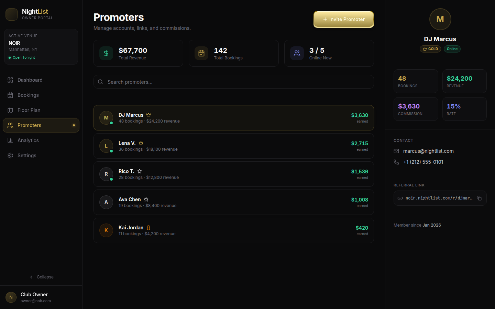
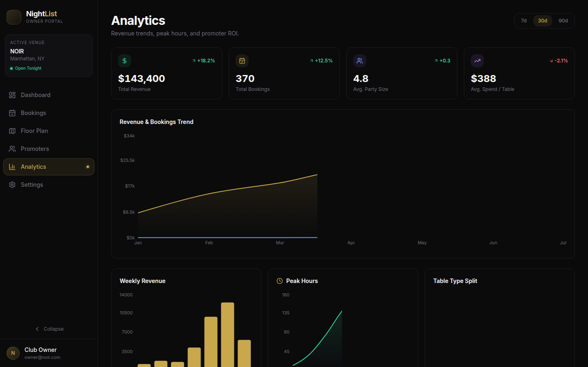
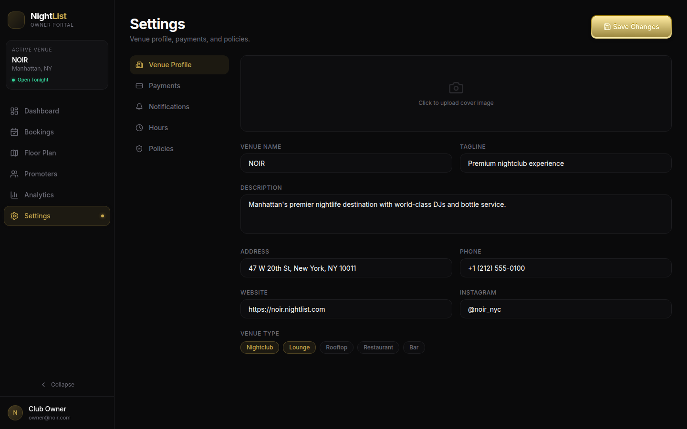
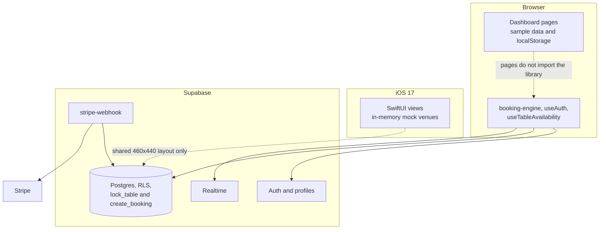

# Night List

Nightlife table booking for venue owners and guests: a React owner dashboard, a SwiftUI floor-plan viewer, and a Supabase schema for reservations.

The dashboard runs in the browser on sample data. The database, booking functions, and Stripe webhook are in this repo and are not called by those screens yet. Nothing here is deployed.

## Screenshots

Captured from `npm run dev` in `dashboard/` with no backend. Figures, guest names, and the "Stripe Connect / Connected" badge are fixtures in the React components.

| Home | Floor plan | Bookings |
| --- | --- | --- |
|  |  |  |

| Promoters | Analytics | Settings |
| --- | --- | --- |
|  |  |  |

## Features

| Area | In the UI | In the backend |
| --- | --- | --- |
| Floor plan builder | Yes. Drag tables and fixtures on a 460×440 canvas, snap to a 12px grid, zoom, and autosave to `localStorage` (`nightlist.floorplan.layout.v2`). | `venue_tables` stores `layout_x/y/width/height`. The builder does not write those rows. |
| Bookings | Yes, as a filterable list of hardcoded reservations and a guest-list modal. | `bookings` table, a partial unique index so one active booking exists per table per date, and `lock_table` / `create_booking` RPCs. |
| Promoters | Yes, as a static roster with tiers, links, and commission numbers. | `promoters` and `commissions` tables. `create_booking` can attribute a promoter slug and insert a commission row. |
| Analytics | Yes. Area, bar, and pie charts render hardcoded series. | No analytics queries. |
| Settings | Yes. Venue, payments, notifications, hours, and policies persist to `localStorage` (`nightlist_settings`). | `venues` has matching policy and hours columns. The form does not update them. The payments tab always shows Stripe as connected. |
| Booking engine | Not mounted. | `dashboard/src/lib/booking-engine.ts` locks a table for 10 minutes, creates a booking, attaches a Stripe PaymentIntent, transitions status, cancels inside the venue's window, and lists guest or venue bookings. `useTableAvailability` refetches on Realtime changes to `bookings` and `table_locks`. |
| Auth | No login screen. The shell does not read a session. | `useAuth` signs in, signs up, and signs out with email and password, then loads `profiles.role` (`guest`, `promoter`, `owner`, `admin`). A trigger creates the profile row. RLS is enabled on every public table. |
| iOS viewer sync | The phone app shows mock venues. | Same 460×440 coordinate space as the web canvas, and the mock tables use the web seed coordinates. There is no Supabase client in the iOS target, so a layout saved in the browser does not appear on the phone. |

`dashboard/src/lib/validation.ts` has email, phone, URL, and booking-form checks. No page imports it.

## Architecture



The Stripe edge function checks the webhook signature, then uses `SUPABASE_SERVICE_ROLE_KEY` from the environment to mark a booking confirmed, failed, refunded, or partially refunded. Dispute events are logged. `account.updated` writes the same `stripe_account_id` it already matched. Secrets for that function are not in the repo.

## Tech stack

| Layer | What this repo uses |
| --- | --- |
| Owner dashboard | React 18, TypeScript, Vite 5, Tailwind CSS 3 |
| iOS app | SwiftUI, Swift 5, iOS 17. Blueprint drawing uses SwiftUI `Canvas`. |
| Backend | Supabase Postgres, Auth, Realtime, and one Deno edge function |
| Payments | Stripe webhook handler only. No Stripe.js checkout and no Apple Pay flow. The iOS entitlements file lists Sign in with Apple and a placeholder merchant id `merchant.` |
| CI | GitHub Actions. See below. |

## Repo layout

```
night-list/
├── dashboard/                 # Owner web app
│   └── src/
│       ├── pages/             # Home, bookings, floor plan, promoters, analytics, settings
│       ├── lib/               # Supabase client, booking engine, hand-written DB types
│       └── hooks/             # useAuth, useTableAvailability (unused by the pages)
├── ios/NightList/             # SwiftUI app (Discover, bookings, owner, blueprint)
├── prototype/                 # Early single-file React UI, not part of the Vite app
├── supabase/
│   ├── config.toml            # Local CLI config (`supabase start`)
│   ├── migrations/            # 001_initial_schema.sql
│   └── functions/stripe-webhook/
├── docs/screenshots/          # Dashboard captures used above
├── .env.example               # Placeholders only
└── .github/workflows/ci.yml
```

## Local setup

### Dashboard

Node.js 22 is what CI uses. The UI does not need env vars.

```bash
cd dashboard
npm ci
npm run dev
```

Open the URL Vite prints (usually http://localhost:5173). Production build: `npm run build` (output in `dashboard/dist/`). `npm run lint` and `npm run typecheck` match CI.

### Supabase

Install the [Supabase CLI](https://supabase.com/docs/guides/local-development/cli/getting-started), then from the repo root:

```bash
supabase start
supabase status
```

`supabase start` applies `supabase/migrations`. Copy the example env into the Vite project (Vite does not read a `.env` at the repo root):

```bash
cp .env.example dashboard/.env
```

Set:

- `VITE_SUPABASE_URL` to the local API URL (`http://127.0.0.1:54321` in `supabase/config.toml`)
- `VITE_SUPABASE_ANON_KEY` to the anon key printed by `supabase status`

`dashboard/src/lib/supabase.ts` throws if either variable is missing. That module loads only when something imports the booking engine, auth hook, or availability hook. The current pages do not.

The anon key is the client key. Do not put the service role key in `dashboard/.env`. The webhook reads `SUPABASE_SERVICE_ROLE_KEY`, `STRIPE_SECRET_KEY`, and `STRIPE_WEBHOOK_SECRET` from the function environment (`supabase secrets set` when you deploy it). `supabase/config.toml` sets `verify_jwt = false` for `stripe-webhook` so Stripe can call it.

### iOS

```bash
cd ios
open NightList.xcodeproj
```

Build and run in Xcode on macOS (deployment target iOS 17). The app uses `Venue.mockVenues` and does not talk to Supabase. CI does not compile it; GitHub-hosted runners used here are Linux and do not have Xcode.

### Prototype

`prototype/NightListPrototype.jsx` is an earlier single-file UI. It is not imported by the dashboard.

## CI

`.github/workflows/ci.yml` runs on `push` and `pull_request` with `permissions: contents: read`.

- **dashboard:** `npm ci`, `npm run lint`, `npx tsc --noEmit`, `npm run build`, with npm cache from `dashboard/package-lock.json`
- **gitleaks:** `gitleaks/gitleaks-action@v2` on full git history. This repo is a personal account, so the action does not need a `GITLEAKS_LICENSE`.

ESLint uses the recommended JavaScript and TypeScript rules. Unused vars are warnings. `no-explicit-any` is off. `no-undef` is off because TypeScript already checks names.

## Status and roadmap

Done in this repository:

- Owner dashboard shell with six pages
- Floor plan editor and settings form, both stored in the browser
- Postgres schema, row level security, and booking RPCs (`lock_table`, `create_booking`, `cleanup_expired_locks`)
- Typed booking client, auth hook, and realtime availability hook, not imported by the pages
- Stripe webhook function for payment success, failure, and refunds
- SwiftUI prototype: discover, venue, blueprint, booking sheets, and an owner tab, all on mock data

Not done:

- Point the dashboard pages at Supabase, including a real login gate
- Persist floor plans and settings to `venue_tables` and `venues`
- Guest checkout, Stripe.js, and a real Apple Pay merchant id
- iOS networking so the blueprint follows the saved layout
- Push notifications (the settings tab only shows a note about APNs)
- A hosted dashboard or API
- App Store submission

## License

[MIT](LICENSE). Copyright (c) 2026 Lesley.

Built by [@lloredia](https://github.com/lloredia).
